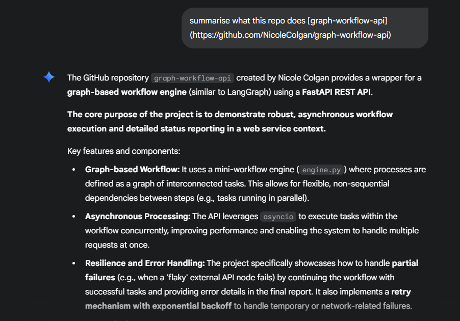
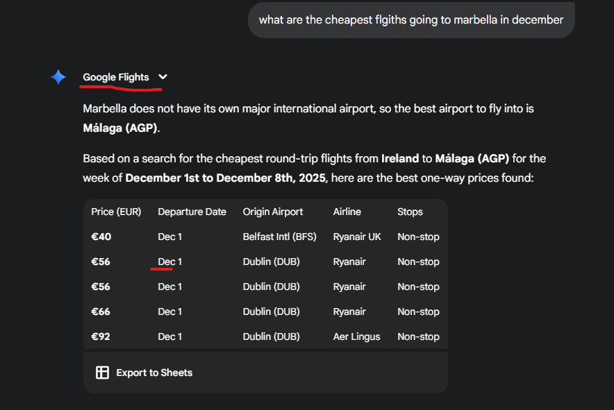
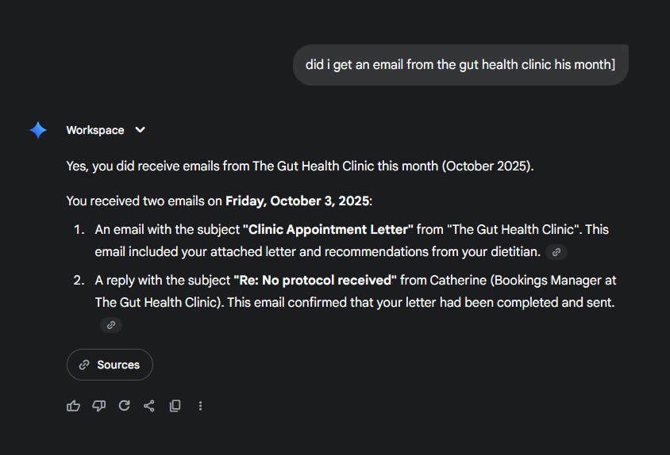

# Intro to AI

### 🧠 Introduction to AI — Notes

* **AI (Artificial Intelligence):**
  The simulation of human intelligence in machines to perform tasks like reasoning, learning, and problem-solving.

* **Augmented Intelligence:**
  Focuses on **extending human capabilities**, not replacing them — humans + AI working together.

* **Goal of AI:**
  Enable task completion beyond what humans or machines could do alone.

### ⚙️ Methods to Develop Machine Learning Models

* **Supervised Learning:**
  Model learns from **labeled data** (e.g., predicting house prices).
* **Unsupervised Learning:**
  Model finds **patterns in unlabeled data** (e.g., customer segmentation).
* **Reinforcement Learning:**
  Model **learns by trial and error** through rewards and penalties (e.g., game AI).

### 🤖 Types of AI

* **Weak/Narrow AI:**
  Designed for **specific tasks only** (e.g., language translation, chatbots, image recognition).
* **Strong/General AI:**
  Can **understand and learn across different domains** — as versatile as a human (still theoretical).
* **Super AI:**
  Would have **human-level consciousness and emotions** — currently **not achievable** due to the unclear nature of consciousness itself.

### Augmented Intelligence vs Artificial Intelligence

* **Artificial Intelligence (AI):** Systems designed to replace human involvement in completing tasks.

  * *Example:* Self-driving car that drives completely on its own.

* **Augmented Intelligence:** Systems that support or enhance human abilities instead of replacing them.

  * *Example:* A car that detects a possible collision and alerts the driver to react.

* **Key Differences:**

  * AI aims to automate tasks; Augmented Intelligence assists humans.
  * In AI, the machine acts independently; in Augmented Intelligence, the human stays in control.
  * AI focuses on replacing human thinking; Augmented Intelligence enhances human decision-making.

* **Why Augmented Intelligence is Valuable:**

  * Humans excel at creativity, emotional intelligence, and ethical judgment.
  * Machines excel at analyzing large data sets, precision, and speed.
  * Combining both gives the most effective and reliable outcomes — the best of both worlds.

### Generative AI (GenAI)

**What it is:**
Generative AI creates new content across text, images, audio, video, or code.

**Large Language Models (LLMs):**
Models that process and generate human-like text using advanced neural networks.

**Capabilities:**

* Diverse content creation
* Human-like conversations

# AI Chatbots
**What are AI Chatbots and Smart Assistants?**
- AI chatbots are software programs that can understand and respond to user queries, perform tasks, and provide information.
- They use natural language processing (NLP) and advanced algorithms to simulate human-like conversations.

**How Do They Work?**
- Chatbots analyze user input to identify intent and keywords, converting speech to text if necessary.
- They use a knowledge base and machine learning to generate relevant responses based on user preferences and past interactions.

**Benefits and Applications**
- AI chatbots are available 24/7, can handle many inquiries simultaneously, and provide personalized services.
- They are used in various industries, including customer service, e-commerce, healthcare, and education, to improve efficiency and user experience.

# Applications of ai in every day use 
In the video, several applications of Generative AI and machine learning are mentioned. Here’s a summary of those applications:

### Applications of Generative AI:
- **Text Generation**: Tools like ChatGPT and Google Gemini for generating text.
- **Image Generation**: Advanced models like Stable Diffusion and DALL-E for creating images from text prompts.
- **Voice and Music Generation**: Tools like MIRV and AIVA for generating music and voice.
- **Video Generation**: Algorithms like Google's Imogen Video and OpenAI Sora for creating lifelike videos.

### Applications of Machine Learning:
- **Customer Service**: Chatbots for handling text-based queries.
- **Fraud Detection**: Machine learning models to identify suspicious transactions in financial services.
- **Healthcare**: Analyzing medical images to assist in diagnoses.
- **Transportation**: Google Maps for traffic condition analysis and ride-sharing apps for matching riders with drivers.
- **Cybersecurity**: Identifying and responding to cyberattacks using reinforcement learning.

# Using AI
- With Gemini you can create interactive documents, make it create quizes you can share and answer yourself there and get results for, use diffrent pre-build models, or create your own

* Fore creating your own chat bot you can add your own documents and everything so it can asnwer based on your docs. its basically a massively simplified rag

* The image generator is actualy rediculously good

* You can create your own bot, you can do deep research. you can ask it to fact check what it says (since its google, it will do this by researching)

* You can pas a url to an llm and ask it questions based on it in the form `[url name](https://actual-url)`

* Gemini has so many integrations with everything google. its so handy. It integrates wiht loads of diff apps and can answer real time questions using them unlike chatgpt. look here, i asked it about flight info and it used google flights to give me the best flights in real-time

* Theres also loads more tools. I'll have to learn how to properly use them all
* I even asked it about my emails and it immediately answers it

