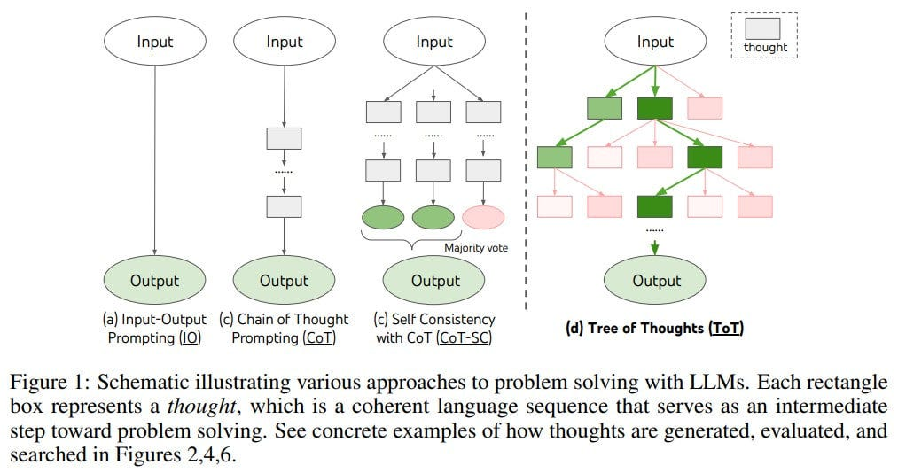
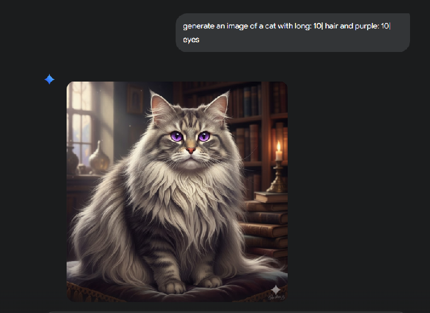
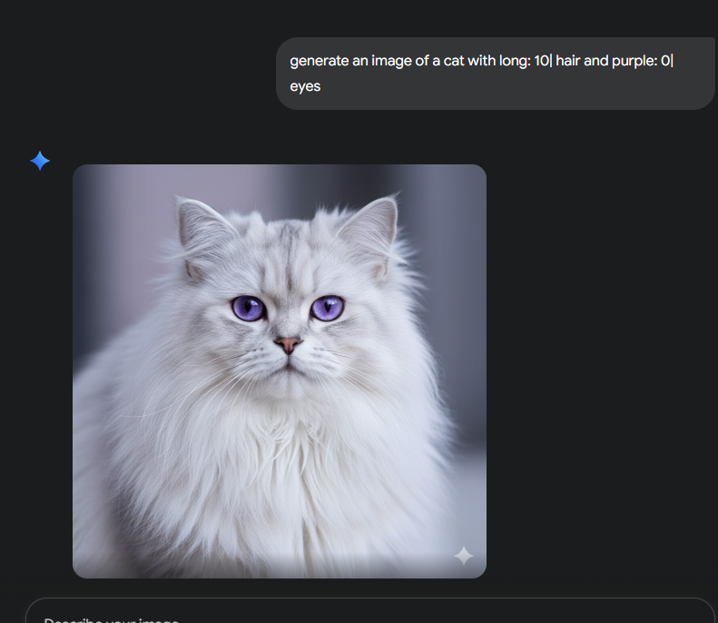

# Prompt engineering technologies and approached

## Text-to-text promp techniques
* Techniques:
    * task specification
    * contextual guidance: extra details
    * domain expertise: domain specific terminology
    * Bias mitigation: instructions to do this
    * Framing: within boundaries eg "in 100 words"
    * zero-shot prompting
    * user feedback loop: iteratively adjust output eg first prompt could be write a poem and second could be, use this output but make it more humourous
    * few-shot prompting: 

## Interview pattern approach
This means designing a prompt by simulating a conversation or interview style
How it works:
    * provide model with prompt instructions that it can reply with follow up questions
    * Depending on your answer to its follow up questions and the original promptt, the model can draw info from it, process it and come up with a better answer
    * Each question the llm asks generally builds on the previous one

## Chain of thought approach
The **Chain of Thought (CoT)** approach in prompt engineering is a technique used to improve the reasoning capabilities of large language models (LLMs) by instructing them to **show their work** before providing a final answer.

Instead of just asking the model for the final solution, you ask it to **break down the problem into sequential steps**, forcing it to mimic a human's thought process. This makes the answer more accurate, especially for complex reasoning, math, and multi-step logic problems.

## How the CoT Approach Works
The CoT method essentially transforms the LLM's task from direct answer generation into a two-part process: **Reasoning $\rightarrow$ Answer.**

### 1. The Prompting Trick

The simplest and most common way to enable CoT is by adding a phrase to your prompt like:

> "Let's think step by step."

This phrase, or similar ones, acts as a trigger for the model to activate its internal reasoning process.

| Prompt Type | Input Example | Model Response | Accuracy |
| :--- | :--- | :--- | :--- |
| **Standard** | "A bat and ball cost \$1.10. The bat costs \$1.00 more than the ball. How much is the ball?" | "\$0.10" (Incorrect) | Low |
| **Chain of Thought (CoT)** | "A bat and ball cost \$1.10. The bat costs \$1.00 more than the ball. How much is the ball? **Let's think step by step.**" | "**Step 1:** Total cost is \$1.10. **Step 2:** Let $x$ be the ball's cost. The bat is $x + 1$. **Step 3:** $x + (x + 1) = 1.10$. **Step 4:** $2x = 0.10$. $x = 0.05$. The ball costs **\$0.05**." (Correct) | High |

## Why CoT Works

1.  **Overcoming Hasty Answers (System 1 vs. System 2):** It forces the model out of its fast, associative (System 1) thinking and into slower, deliberate, analytical (System 2) thinking.
2.  **Increased Token Space:** By generating intermediate steps, the model has a longer internal thought process, giving it more "working memory" to hold and process complex pieces of information before arriving at the conclusion. 

## two main methods
**1. Zero-Shot CoT (No Examples Needed)**
This is the method shown above. You simply add the trigger phrase ("Let's think step by step" or "Explain your reasoning") to a prompt, and the model follows the instruction. It's the easiest and fastest way to implement CoT.

**2. Few-Shot CoT (Providing Examples)**
This is an older, but often more powerful, technique. You include a few example questions and their step-by-step reasoning in the prompt before asking your final question.

You tell the model: "Here is how to solve these problems by reasoning through them."

The model learns: It copies the style and depth of reasoning from your examples to solve the new, similar problem.

## tree-of-thought approach

In this paradigm, reasoning is represented as a tree rather than a linear chain. This allows the model to backtrack if the reasoning veers off track.

The core premise of these studies is that the thought process isn't linear but more akin to navigating a tree. One might explore a branch, find it unfruitful, backtrack, and then try a different path. This implies multiple rounds of interaction between the LLM and the agent providing prompts.

eg. I am considering a career change, please explore three different options based on my skills and interests and for each option consider the pay, advantages and disadgvantages before giving me what you think is the best option for me

eg2. 
`You are planning a school fundraising event.
Follow this structure:

List three different types of events (label them A, B, C).

For each event, list:
    a. Key benefits
    b. Likely challenges
    c. What resources would be needed

Compare the three events and choose the most feasible one. Explain why it is better than the others.

This approach is particularly useful for real-world situations that demand layered decision making

## Key considerations when choosin a prompt engineering approach
* edit prompt considering the model your using cause different ones are better for diff tasks
* Use feedback to improve output - i do that anyways

## Multimodal prompts
combining different modalities into one prompt eg text + image 

## The play-off method: a powerful tool in prompt engineering
uses competitive approach by comparing prompts and selecting the best one
The Playoff Method is inspired by the structure of a sports tournament, where multiple candidates (in this case, prompt responses) compete against each other in a series of elimination rounds. By pairing responses and selecting the best option in each round, this method leads to the identification of the most effective prompt or response through systematic comparison.

**steps**
1. generate prompts
2. pair promps
3. evaluate and select based based on criteria
4. continue the tournament by pairing the best ones
5. one left at the end is the winner

## Text to image prompt techniques
techniques:
    * style modifiers: modify styles or visual attributes eg colour, text, photography techniques
    * Quality boosters: terms to increase quality eg noise reduction, sharpening, use terms like 4k, sharp focus, blurred background
    * repitition: Repeating a keyword, phrase, or concept multiple times within a prompt to increase its visual weight or importance to the image generation model. The goal is to ensure the AI prioritizes that specific element, leading to a more pronounced, detailed, or emphasized representation of it in the final image.
    * weighted terms: give positive or negative weights to certain words to emphasise or de-emphasise certain emotions eg "luxury" to create images which give off a luxurious vibe eg
        ` Craft an image of cozy living area with a warm: 10| crackling: 8| fireplace` This gives a weight of 10 to warm and 8 to crackling indicating to pay more attention to the word warm
        
        
        
    `Depict a busy street market with colourful: -6|, exotic: 10| food stalls`
    * Fix deformed generation: fixing distortion. you put the negative feedback in square brackets
        `generate an image of a cat with long: 10| hair and purple: 0| eyes: [background blurred]`
        `A smiling girl: [deformed face, cross-eyed]`