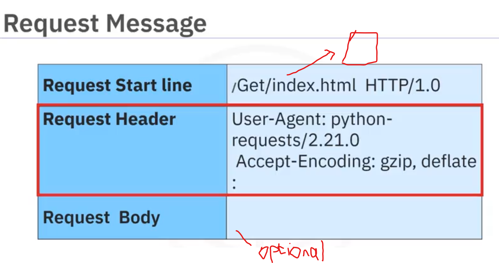
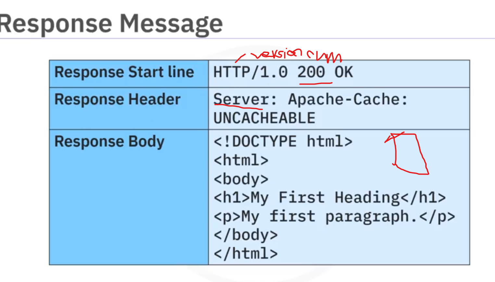
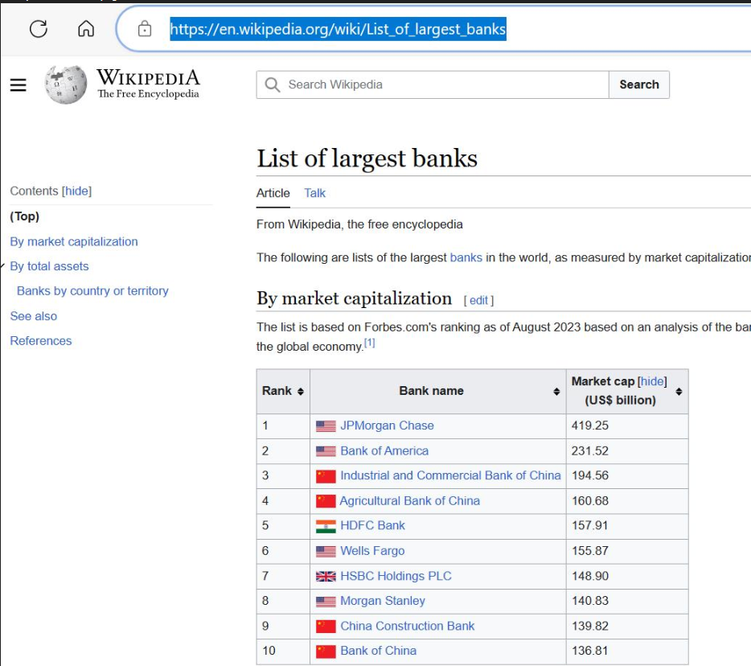

# APIs and data collection

## APIs
An API lets two pieces of sw talk to eo
pandas is an API and when you create a dataframe using `pd.DataFrame(my_dict)`, the dict is passed to the pandas API
* When you call `df.head()` again it calls the api with ur df and it returns teh result
* REST APIs let you communicate through the internet and make use of resources like storage:
    * REST APIs are used to interact with web services
    * client communicated with the resource (web service) vis a http message which contains a request and usually a json message. Teh json message provides instructions about what operation we want the ervice to perform


```python
# convert from time series to data time
data["date"] = pd.to_datetime(data["TimeStamp"], unit="ms") # 34870823457 -> 2025-01-22 18:01:54:207
```

## Intro to APIs project
[intro-to-apis](./projects/APIs-and-data-collection/intro-to-apis.ipynb)

## Rest APIs and HTTP requests P1
url = uniform resource locator
http is a general protocol for transferring information through the web
* Rest apis work by sending a request (via a http message). http message usually contains a json file
* When the user is using a web page, the browser sends a http request to the server where the application is hosted. if its succesful, server will try to find the resource (usually index.html) then send a http response back to the client which will include info like the type of the resource, length of resource and otehr info. 
* The server stores resources: index.html, Image.png, File.txt. when the info is requested the server sends these resources
* url is the most popular way to find resources on the web:
    * we can break the url into parts:
        * scheme: the protocol - http://
        * base url/Internet address - www.google.com
        * route: location on the webserver - /images/specificImage.png
* request message 
* response message 
* status codes:
    * 1XX: Informational
        * 100: Everything so far is ok
    * 2xx: success
        * 200: OK
    * 3XX: redirection
        * 300: multiple choices
    * 4XX: client error
        * 401: unauthorised
        * 403: forbidden
        * 404: not found
    * 500: server error
        * 501: no implemented
* When a http message is made a http message is sent:
    * GET data from the srever
    * POST data to the server
    * PUT update data already on the server
    * DELETE data from the server

## Rest APIs and HTTP requests P2 - dealing with HTTP using the requests library in Python
```python

# requests is a library for sending http requests
import requests
url = "https://www.google.com"
r=requests.get(url)
r.status_code
r.request.headers   # request header
r.request.body  # request body
r.headers   # response header - dictionary
r.headers["date"]   # get date the request was sent
r.headers["Content-Type"]   # get response content type of the data
r.encoding
r.text[0:100]   # since response is text we can access text then pull out a bit of it (100 characters)

# you can use the get method to modify your results
# request structure - ? = start of query string
# get request - baseurl/get?Name=Nicole&ID=1
url_get = "http://httpbin.org/get"
payload = {"name": "nicole", "ID": "123"}
r = requests.get(url_get, params=payload)
r.url   # print url to see name and values - http://httpbin.org/get?name=Nicole&ID=123
r.body
r.status_code
r.text
r.headers["Content-Type"]   # get response content type of the data
r.json()    # to get json response in dict format
r.json()["args"]    # get arguments as dict - {"name": "nicole", "ID", "123"}


# Request - the post request send the request in a request body not a url
url_post = "http://httpbin.org/post"
payload = {"name": "nicole", "ID": "123"}
r_post=requests.post(url_post,data=payload)
print(r_post.url)   # http://httpbin.org/post  - notice how theres no params on it or anything - thats cause theyre in the body
r_post.body #will have data
r_post.json()["form"]   # Gets the payload - {"ID": "123", "name": "nicole"}
```

## Web scraping and htmml basics
Web scraping means extracting data from web pages. It involves automated retrieval of data from web sources

### How web scraping works
1. HTTP request: A web scraper sends an HTTP request to a specific URL, similar to how a web browser would when you visit a website. The request is usually an HTTP GET request, which retrieves the web page's content.
2. Web page retrieval: The web server hosting the website responds to the request by returning the requested web page's HTML content.
3. HTML parsing: Once the HTML content is received, you need to parse the content. Parsing involves breaking down the HTML structure into components, such as tags, attributes, and text content. You can use BeautifulSoup in Python. It creates a structured representation of the HTML content that can be easily navigated and manipulated.
4. Data extraction: With the HTML content parsed, web scrapers can now identify and extract the specific data they need. This data can include text, links, images, tables, product prices, news articles, and more. Scrapers locate the data by searching for relevant HTML tags, attributes, and patterns in the HTML structure.
5. Data Transformation: Extracted data may need further processing and transformation. For instance, you can remove HTML tags from text, convert data formats, or clean up messy data. This step ensures the data is ready for analysis or other use cases.
6. Storage: After extraction and transformation, you can store the scraped data in various formats, such as databases, spreadsheets, JSON, or CSV files
7. Automation: In many cases, scripts or programs automate web scraping. These automation tools allow recurring data extraction from multiple web pages or websites. Automated scraping is especially useful for collecting data from dynamic websites that regularly update their content.

Beautiful Soup is a powerful tool for navigating and extracting specific web page parts. It allows you to find elements based on their tags, attributes, or text, making extracting the information you're interested in easier.

Pandas, a Python library, provides a function called read_html, which can automatically extract data from websites' tables and present it in a format suitable for analysis. It’s similar to taking a table from a webpage and importing it into a spreadsheet for further analysis.

```python
# Web scraping requires Python code and two essential modules: Requests and Beautiful Soup. 
from bs4 import BeautifulSoup
import requests

# specify url of the web page you want to scripa
url = "https://en.wikipedia.org/wiki/page"

# send get request to web page
response = requests.get(url)

# store html content in a variable
html_content = response.text

# create beautiful soup object to parse the html
soup = BeautifulSoup(html_content, "html.parser")

# display snippe of html content
print(html_content[:500])

# beautiful soup now represents the html cotnent as a tree like structure for easy navigation
# you can use methods like find_all to extract specific elements
links = soup.find_all("a")

# Iterate through list of links and find their text
for link in links:
    print(link.text)
```

## Project on rest apis and http requests
[rest-apis-request-http](./projects/APIs-and-data-collection/Rest-APIs-Requests_HTTP.ipynb)

## API project
[apis](./projects/APIs-and-data-collection/apis.ipynb)

## Web scraping
Instead of manually going through loads of diff websites looking for the info your looking for,  you can use web scraping to automatically extract info from different sites
```python
from bs4 import BeautifulSoup

html = "<!DOCTYPE html><html><body><p><b>hi<b></p></body></html>"

# Beautiful soup represents the html like a tree and has mehods to parse the html
soup = BeautifulSoup(html, "htm;5lib")

# tga object corrosponse to a html tag in the original document eg a title tag
tag_object = soup.title # <title>Page title</title>

# if theres more than one tag with the same name, the first element with that tag is selected
tag_object = soup.h3

# if the tag has a child object eg text inside a paragraph is bold (b - tag), we can access it like follows
tag_child=tag_object.b  # <b>bold writing inside paragraph element</b>

# you can navigate up the tree by using the parent attribute
parent_tag = tag_child.parent   # <p>paragraph that we got the bold child from<p>

# we can also find the siblings of an object eg if the body has a paragraph, h3 etc then paragraph, h3 etc are siblings
sibling_1 = tag_object.next_sibling
sibling_2 = sibling_1.nect_sibling

# get attributes
tag_child.attrs # {"id": "bold"} - returns as kv pair in dict

# get text content as naviggable string
text_content = tag_child.string # bold writing inside paragraph element


# find all can be used to filter to find elements base don tag name, attributes, text of a string or some combination of these
html = "<table><tr><td>pizza place</td><td<orders</td><td>slices</td></tr> <tr><td>dominos pizza</td><td>10</td><td>100</td></tr>"

table = BeautifulSoup(html, "html5lib")

table_row = table.find_all(name="tr")   # - result is python iterable like a list [<tr><td>pizza place</td><td<orders</td><td>slices</td></tr>, <tr><td>dominos pizza</td><td>10</td><td>100</td></tr>]

# since each element in the iterable is a ag object we can access the rows
first_row = table_row[0]
first_row.td    # first table cell - <td>pizza place</td>

# can also iterate through each table cell

for i, row in enumerate(table_rows):
    print("row", i)
    cells = row.find_all("td")
    for j, cell in enumerate(cells):    # iterate through each cell (column) for each row
        print("column",j,"cell",cell)


# how to apply beautiful osup to a web page
import requests

page = requests.get("https://google.com/page").text

soup = BeautifulSoup(page, "html.parser")

# get all <a> tage
artists = soup.find_all("a")

# clears data of all tage
for artist in artists:
    names = artist.contents[0]
    fullLink = artist.get("href")
    print(names)
    print(fullLink)
```

### Imortance of web scraping
In the field of data science, web scraping plays an integral role. It is used for various purposes such as:

Data Collection: Web scraping is a primary method of collecting data from the internet. This data can be used for analysis, research, etc.
Real-time Application: Web scraping is used for real-time applications like weather updates, price comparison, etc.
Machine Learning: Web scraping provides the data needed to train machine learning models.

### Libraries for web scrapng
1. BeautifulSop: pulls data out of html and xml files. creates a tree which we can extract data from
2. Scrapy: web crawling framework to extract data from websites
3. selenium: controls ewb pages through programs and sutomating browser taks which can be used i guessto get it too

### Applications of Web Scraping
Web scraping is used in various fields and has many applications:
  * Price Comparison: Services such as ParseHub use web scraping to collect data from online shopping websites and use it to compare the prices of products.
  * Email address gathering: Many companies that use email as a medium for marketing, use web scraping to collect email ID and then send bulk emails.
  * Social Media Scraping: Web scraping is used to collect data from Social Media websites such as Twitter to find out what's trending.

## Web scraping using pandas
The Pandas library in Python contains a function read_html() that can be used to extract tabular information from any web page.

basically its only used for tables - since thats kinda what pandas works with anyways - tabular data 

Although convenient, this method comes with its own set of limitations.
Firstly, web pages may have content saved in them as tables but they may not appear as tables on the web page.

Secondly, the contents of the tables in the web pages may contain elements such as hyperlink text and other denoters, which are also scraped directly using the pandas method. This may lead to a requirement of further cleaning of data.
A closer look at table 3 in the image shown above indicates that there are many hyperlink texts which are also going to be treated as information by the pandas function.

using this image for the below example - 

```python
import pandas as pd
url="https://en.wikipedia.org/wiki/list_of_largest_banks"
tables = pd.read_html(url)
df = tables[0]  # first table
print(df)


# extract hyperlinks too
import pandas as pd
URL = 'https://en.wikipedia.org/wiki/List_of_countries_by_GDP_(nominal)'
tables = pd.read_html(URL)
df = tables[2] # the required table will have index 2
print(df)
```

## Web scraping project
[web-scraping-project](./projects/APIs-and-data-collection/web_scraping.ipynb)

## working with different file formats
```python

# reading csvs
import pandas as pd
file = "Example.csv"
df = pd.read_csv(file)  # if the file has no header, this will print the first line of data as a header

# we can solve the above issue by adding a df attribute - columns
df.columns = ["name", "phone number", "bday"]


# json 
import json
with open("filename.json", "r") as f:
    json_obj = json.load(f)
    print(json_obj)


# xml - theres no good way to do this so you just have to read in the xml like a tree then loop through it to create a dataframe
import xml.etree.ElementTree as etree

tree = etree.parse("filename.xml")
root = tree.getroot()
columns = ["Name", "phone numbee", "bday"]
df = pd.DataFrame(columns=columns)

for node in root:
    name = node.find("name").text   # name is like a tag in xml
    phone_number = node.find("phonenumber").text
    bday = node.find("bday").text

    df = df.append(
        pd.Series([name, phone_number, bday],   # append one line at a time - a series
        index=columns....,
        ignore_index=True
        )
    )
```

## working with different file formats project
[working-with-different-file-formats-project](./projects/APIs-and-data-collection/working-with-different-file-formats.ipynb)

## GDP Data Extraction and Processing project
[GDP-data-extraction-and-processing](./projects/APIs-and-data-collection/GDP-data-extraction-and-processing.ipynb)

# More on apis and data collection
```python
# Access the value of a specific attribute of an HTML element.
href = link_element[(href)]

# Send a DELETE request to remove data or a resource from the server. DELETE requests delete a specified resource on the server.
response = requests.delete(url)

# Find the first HTML element that matches the specified tag and attributes.
element = soup.find(tag, attrs_dict)

# Find all HTML elements that match the specified tag and attributes.
elements = soup.find_all(tag, attrs)

# Find all child elements of an HTML element.
children = element.findChildren()

# Include custom headers in the request. Headers can provide additional information to the server, such as authentication tokens or content types.
base_url = "https://api.example.com/data" 
headers = {"Authorization": (Bearer YOUR_TOKEN)} 
response = requests.get(base_url, headers=headers)

# 	Parse JSON data from the response. This extracts and works with the data returned by the API. The response.json() method converts the JSON response into a Python data structure (usually a dictionary or list).
response = requests.get((https://api.example.com/data)) 
data = response.json()

# Send a POST request to a specified URL with data. Create or update POST requests using resources on the server. The data parameter contains the data to send to the server, often in JSON format.
response = requests.post((https://api.example.com/submit), data={(key): (value)})

# Send a PUT request to update data on the server. PUT requests are used to update an existing resource on the server with the data provided in the data parameter, typically in JSON format.
response = requests.put((https://api.example.com/update), data={(key): (value)})

# Pass query parameters in the URL to filter or customize the request. Query parameters specify conditions or limits for the requested data.
base_url = "https://api.example.com/data"
params = {"page": 1, "per_page": 10}
response = requests.get(base_url, params=params)

# Select HTML elements from the parsed HTML using a CSS selector.
titles = soup.select((h1))

# Check the HTTP status code of the response. The HTTP status code indicates the result of the request (success, error, redirection). Use the HTTP status codeIt can be used for error handling and decision-making in your code.
url = "https://api.example.com/data"
response = requests.get(url)
status_code = response.status_code

# Retrieve the text content of an HTML element.
title_text = title_element.text
```