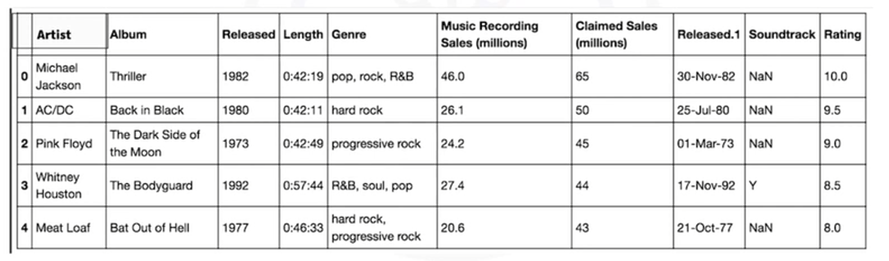
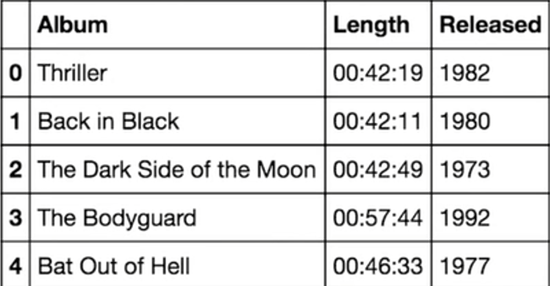
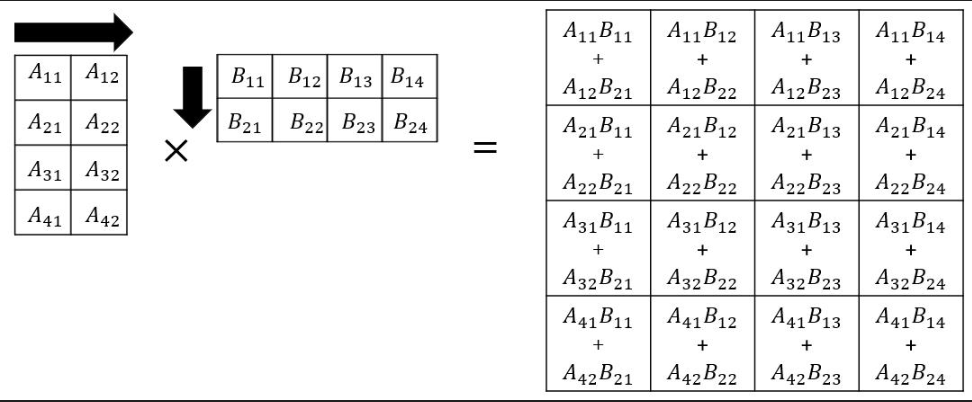
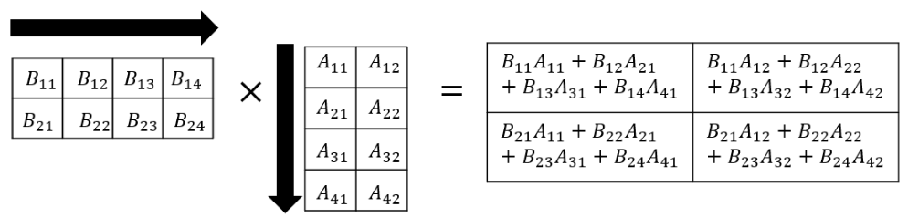

# Working with data in Python

## Reading files with open
```python
file1 = open("/resources/data/Example.txt", "r")    # modes we can use are "r", "w", "a": appending

file_name = file1.name
file_mode = file1.mode

# always close the file when your done reading
file1.close()

# using a with statement is better cause it automatically closes the file
with open("/file.txt", "r") as file:
    file_contents = file.read()
    print(file_contents)    # This will output \ns for new linees like "hi...\nthis is a new line...\n"

    # if we just want to read line by line
    line = file.readline()
    print(line)
    line2 = file.readline() # it automatically moves to the next line

    # you can also specify how many CHARACTERS you wanna read from a line
    # note the last character in every line is the bnew line character
    lines = file.readlines(2)   # prints first 4 characters in line

    if "important" in lines:
        print("These lines are important")


# you can check if the file is closed even outside the function
# you can also print the file contents outside the indednt too
print(file.closed)  # true
print(file_content)

# loop through lines until theyre done

while True:
    line = file.readline()
    if not line:
        break   # stop when no lines left to read
    print(line)
file.close()

# If you want to read characters from a specific position in the file, you can use the seek() method. This method moves the file pointer (like a cursor) to a particular position.

character_position_3 = file.seek(2)  # 0-based index

# this can be used to read a specified number of characers starting at where the pointer is at. so if we moved the pointer above to index 3 then it will read 5 characters starting from this index
characters = file.read(5)
```

## reading files project
[reading files](./projects/reading-files.ipynb)

## Writing files with open
```python

with open("text.txt", "w") as file:
    file.write("This is line1\n")
    file.write("This is line2\n")
    # file is automatically closed

Lines = ["This is line 1", "This is line 2", "This is line 3"]
with open('Example3.txt', 'w') as file2:
    for line in Lines:
        file2.write(line + "\n")

# append to a file without overwriting contents

new_data = "This is another line"
with open('Example3.txt', 'a') as file3:
    file.write(new_data+ "\n")


# copying contents from one file to another
with open("source.txt" as "r") as source_file:
    with open("destination.txt", "w") as destination_file:
        for line in source_file:
            destination_file.write(line)
```

### File modes in Python 

Mode	Syntax	Description
‘r’	'r'	Read mode. Opens an existing file for reading. Raises an error if the file doesn't exist.
‘w’	'w'	Write mode. Creates a new file for writing. Overwrites the file if it already exists.
‘a’	'a'	Append mode. Opens a file for appending data. Creates the file if it doesn't exist.
‘x’	'x'	Exclusive creation mode. Creates a new file for writing but raises an error if the file already exists.
‘rb’	'rb'	Read binary mode. Opens an existing binary file for reading.
‘wb’	'wb'	Write binary mode. Creates a new binary file for writing.
‘ab’	'ab'	Append binary mode. Opens a binary file for appending data.
‘xb’	'xb'	Exclusive binary creation mode. Creates a new binary file for writing but raises an error if it already exists.
‘rt’	'rt'	Read text mode. Opens an existing text file for reading. (Default for text files)
‘wt’	'wt'	Write text mode. Creates a new text file for writing. (Default for text files)
‘at’	'at'	Append text mode. Opens a text file for appending data. (Default for text files)
‘xt’	'xt'	Exclusive text creation mode. Creates a new text file for writing but raises an error if it already exists.
‘r+’	'r+'	Read and write mode. Opens an existing file for both reading and writing.
‘w+’	'w+'	Write and read mode. Creates a new file for reading and writing. Overwrites the file if it already exists.
‘a+’	'a+'	Append and read mode. Opens a file for both appending and reading. Creates the file if it doesn't exist.
‘x+’	'x+'	Exclusive creation and read/write mode. Creates a new file for reading and writing but raises an error if it already exists.

## writing from files project
[writing-from-files](./projects/writing-from-files.ipynb)

## Loading data with pandas



```python

import pandas as pd  # need to have this installed - you can rename it to make it easier

# load a csv file 
# dataframes are good for visualising data
# dataframe is comprised of rows and columns
df = pd.read_csv("filepath.txt")
df.head()   # gives you the first 5 rows in the data frame

# load excel file
df2 = pd.read_excel("xlsx_path")
df2.head()

# you can create a dataframe out of a dictionary
# Keys corrospond to column labels
songs = {
    "Album": ["Thriller", "back in black", "679"],
    "released": [1999, 2001, 2010],
    "length": ["00:42:23", "00:42:11", "00:56:33"]
}

songs_df = pd.DataFrame(songs)

# to add a column to the df
x = songs_df[["artist"]]

# you can do the same with multiple columns
y = x[["rating", "awards"]]

# accessing cells `iloc`
df.iloc[0,0]    # cell 0,0 -> first row first column
df.illoc[1,0]   # second row, first column

# you can also use the row and name of the column - `loc[]`
df.loc[0, "Artist"]

# loc[] can also be used if the index isnt an integer
df.loc["a", "Artist"]

# can also slice dataframes and assign values to a new df
z = df.iloc[0:2, 0:3]

# can also slice with loc using names - this ones inclusive of the last column name i think
z = df.loc[0:2, "Artist":"Released"]
```

## Working with and saving data
```python

import pandas as ps

songs = {
    "Album": ["Thriller", "back in black", "679", "fairchild"],
    "released": [1999, 1999, 2010, 2025],
    "length": ["00:42:23", "00:42:11", "00:56:33", "00:20:00"]
}

songs_df = pd.DataFrame(songs)


# determine unique values in a column of a df using `unique()`
unique_years = songs_df["released"].unique()    # 1999, 2001

# example say you wanted to get songs releasaed after then get their corrosponding rows
# get songs after 1999 -> result is series of booleanslike:
# 0| False
# 1| False
# 2| True
# 3: True
songs_df["released"] >1999

# we can basically use this condition to filter the db like how we do selecting an element in a list
# now we have a new df where all the release dates are greater than 1999
songs_after_1999_df = songs_df[df["released"] > 1999]

# we can save the new df using `to_csv()`
df1.to_csv("songs-released-after-1999.csv") # notice the .csv extension
```

# More on for pandas

## What is pandas
pandas is a data manipulation and analysis library
Pandas is designed to handle data in various formats, such as tabular data, time series data, and more, making it an essential part of the data processing workflow in many industries.

Here are some key features and functionalities of Pandas:

**Data Structures**: Pandas offers two primary data structures - DataFrame and Series.

    1. A DataFrame is a two-dimensional, size-mutable, and potentially heterogeneous tabular data structure with labeled axes (rows and columns).
    2. A Series is a one-dimensional labeled array, essentially a single column or row of data.
    Data Import and Export: Pandas makes it easy to read data from various sources, including CSV files, Excel spreadsheets, SQL databases, and more. It can also export data to these formats, enabling seamless data exchange.

**Data Merging and Joining**: You can combine multiple DataFrames using methods like merge and join, similar to SQL operations, to create more complex datasets from different sources.

**Efficient Indexing**: Pandas provides efficient indexing and selection methods, allowing you to access specific rows and columns of data quickly.

**Custom Data Structures**: You can create custom data structures and manipulate data in ways that suit your specific needs, extending Pandas' capabilities.

### Whats a series 
A Series is a one-dimensional labeled array in Pandas. It can be thought of as a single column of data with labels or indices for each element. You can create a Series from various data sources, such as lists, NumPy arrays, or dictionaries
Here's a basic example of creating a Series in Pandas:

```python
import pandas as pd

# create series from list
data = [1,2,3,4,5]
s = pd.Series(data)

print(s)

# access element in a series
el_1 = s[0] # same as for array

# access by position
el_2 = s.iloc[1]    # 2

# print multiple elements in the series
print(s[1:4])
```
### Series Attributes and Methods
Pandas Series come with various attributes and methods to help you manipulate and analyze data effectively. Here are a few essential ones:

values: Returns the Series data as a NumPy array.
index: Returns the index (labels) of the Series.
shape: Returns a tuple representing the dimensions of the Series.
size: Returns the number of elements in the Series.
mean(), sum(), min(), max(): Calculate summary statistics of the data.
unique(), nunique(): Get unique values or the number of unique values.
sort_values(), sort_index(): Sort the Series by values or index labels.
isnull(), notnull(): Check for missing (NaN) or non-missing values.
apply(): Apply a custom function to each element of the Series.

## What is a DataFrames?
A DataFrame is a two-dimensional labeled data structure with columns of potentially different data types. Think of it as a table where each column represents a variable, and each row represents an observation or data point. DataFrames are suitable for a wide range of data, including structured data from CSV files, Excel spreadsheets, SQL databases, and more.

### DataFrame Attributes and Methods
DataFrames provide numerous attributes and methods for data manipulation and analysis, including:

shape: Returns the dimensions (number of rows and columns) of the DataFrame.
info(): Provides a summary of the DataFrame, including data types and non-null counts.
describe(): Generates summary statistics for numerical columns.
head(), tail(): Displays the first or last n rows of the DataFrame.
mean(), sum(), min(), max(): Calculate summary statistics for columns.
sort_values(): Sort the DataFrame by one or more columns.
groupby(): Group data based on specific columns for aggregation.
fillna(), drop(), rename(): Handle missing values, drop columns, or rename columns.
apply(): Apply a function to each element, row, or column of the DataFrame.

## Selecting data in df project
[selecting-data-in-df.ipynb](./projects/selecting-data-in-df.ipynb)

## Loading data with pandas project
[loading-data-with-pandas](./projects/loading-data-pandas.ipynb)

## One dimensional numpy

```python

# numpy is the basis for pandas

# A numpy array is usually of a fixed size and each element is of the same type which is not the case for lists which can have loads of diff types
# can cast a list to a numpy array
import numpy as np

numpy_array = np.array([0,1,2,3,4])

# can access elements the same way you would a list
numpy_array[0]
type(numpy_array)   # numpy array
numpy_array.dtype   # integer
numpy_array.size    # 5
numpy_array.ndim    # number of dimensions - 1
numpy_array.shape   # size of array in each dimenesion - (5,)

# indexing and slicing
numpy_array[0]=100
new = numpy_array[0:2]  # like in list, last index doesnt count

# can use slicing to provide new values too
numpy_array[0:2] = 200,400  # [200,400,2,3,100]


# basic operations - its usually faster and more efficient to use numpy

# vector addition with numpy - faster and easier to write and more efficient
u = np.array([1,0])
v = np.array([0,1])
z=u+v   # array([1,1])
y=u-v   # array ([1,-1])

# array multiplication with a scalar
x = 2*u # array([2,0])

# vector multiplication
a = u*v # array([0,0])

# dot product - mult corrosponding indexes together then add them eg (v1*u1) + (v2*u2) - result says how simlar to vectors are
dot_product = np.dot(u,v)   # (1*0) + (0*1) = 0

# adding constant to an array adds that val to each element - also known as broadcasting
broadcasted_array = u + 1   # array([2,1])


# a universal function is a function that operates on nd arrays
# you can apply a function to a numpy array
mean_u = u.mean()   # average - .5
max_u = u.max() # 1

# we can use functions that map one array to another
# np.pi is pie
x = np.array([0,np.pi/2, np.pi])
y = np.sin(x)   # y= array([sin(0), sin(pi/2), sin(pi)])

# useful function for plotting mathematical functions is linspace - it specified evenlt spaces numbers over a specified interval
np.linspace(-2,2,num=5) # evenly spaced elements from -2 to 2 with 5 elements

x=np.linspace(0, 2*np.pi, 100)  # 0 to 2 pi spaced by 100 elements
y=np.sin(x)

#display plot - in jupyter we use %matplotlib inline to display plot
import mathplotlib.pyplot as plt
%matplotlib inline
plt.plt(x,y)
```

## 1d numpy project
[1d-numpy](./projects/1d-numpy.ipynb)

## Matrix mathematics
The general rule is that the dot product of an m X n matrix can be done only with an n X p matrix, and the resultant matrix will have the shape m X p. In the example shown below, the 4 X 2 matrix is multiplied with the 2 X 4 matrix to generate a 4 X 4 matrix.



In the reverse example, when 2 X 4 matrix is multiplied with the 4 X 2 one, the resultant will be a 2 X 2 matrix.




## 2d numpy arrays
```python
import numpy as np

a = [[1,2,3], [4,5,6], [7,8,9]]
b = [[1,1,1], [4,4,4], [7,8,9]]
A = np.array(a) # convert to 2d numpy array
A.ndim  # 2d array even tho its shape is 3x3
A.shape # (3,3)
A.size  # 3x3=9

# can also use slicing in numpy multi-dimensional arrays
A[0,0:2]    
# can do matrix edition in the same way as with 1d
a+b
2*a
a*b # same size as a and b
c=np.dot(a,b)   # matric multiplication
```

## 2d numpy array project
[2dnumpy](./projects/Numpy2D.ipynb)

## Numpy reading
Key aspects of NumPy in Python:
* Efficient data structures: NumPy introduces efficient array structures, which are faster and more memory-efficient than Python lists. This is crucial for handling large data sets.
* Multi-dimensional arrays: NumPy allows you to work with multi-dimensional arrays, enabling the representation of matrices and tensors. This is particularly useful in scientific computing.
* Element-wise operations: NumPy simplifies element-wise mathematical operations on arrays, making it easy to perform calculations on entire data sets in one go.
* Random number generation: It provides a wide range of functions for generating random numbers and random data, which is useful for simulations and statistical analysis.
* Integration with other libraries: NumPy seamlessly integrates with other data science libraries like SciPy, Pandas, and Matplotlib, enhancing its utility in various domains.
* Performance optimization: NumPy functions are implemented in low-level languages like C and Fortran, which significantly boosts their performance. It's a go-to choice when speed is essential.

```bash
pip install numpy
```
### Operation with NumPy
* Array Creation: Creating a NumPy array.	arr = np.array([1, 2, 3, 4, 5])
* Element-Wise Arithmetic: Element-wise addition, subtraction, and so on.	result = arr1 + arr2
* Scalar Arithmetic: Scalar addition, subtraction, and so on.	result = arr * 2
* Element-Wise Functions: Applying functions to each element.	result = np.sqrt(arr)
* Sum and Mean: Calculating the sum and mean of an array.Calculating the sum and mean of an array.	total = np.sum(arr) average = np.mean(arr)
* Maximum and Minimum Values: Finding the maximum and minimum values.	max_val = np.max(arr) min_val = np.min(arr)
* Reshaping: Changing the shape of an array.	reshaped_arr = arr.reshape(2, 3)
* Transposition: Transposing a multi-dimensional array.	transposed_arr = arr.T
* Matrix Multiplication:	Performing matrix multiplication.	result = np.dot(matrix1, matrix2)

# cheat sheet for chapter
```python

data_frame.describe()   # states and summary of numeric columns

# drop a row or column from the df, axis=1 means drop a column, axis=0 means drop a row
data_frame.drop(["col2","col3"], axis=1, inplace=True)
data_frame.drop(index=[5,10], axis=0, inplace=True)

data_frame.dropna(axis=0, inplace=True) # drop rows with N/a value
data_frame.duplicated() # duplicate df
duplicated_row = data_frame[data_frame.duplicated()]    # duplicate a row in a df

# filter rows that meet a condition
filtered_df = df_name[(condition)]
filtered_df = df_name[(df["age"] > 30) & (df["salary"] < 50000)]

# groupby splits the df into groups based on specific criteria enabling agregation, transformation or analyysis of data in that group
grouped = df.groupby(["category", "region"]).agg({"sales": "sum"})

# pandas
# info() gets info about the df including data types and memory usage
df.info()

# merge merges two dfs based on multiple common columns
merged_df = pd.merge(df1, df2, on=["col1", "col2"])

# replace specific values in a column with new values
# `df["col name"].replace(old_val, new_val, inplace=True)
df["status"].replace("In progress", "Active", inplace=True)

# display last n rows in df
df.tail(5)
```


