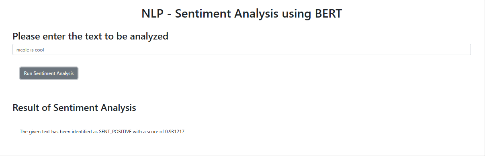

# Creating an AI Application and deplying using Flask

## Project overview
In the practice project, I will create a web app integrated with Watson AI libraries to perform sentiment analysis on the provided text. After developing the app, I will deploy the said application over the web using Flask framework. 

procedure:
Task 1: Create a sentiment analysis application using Watson NLP library
Task 2: Format the output of the application
Task 3: Package the application
Task 4: Run Unit tests on your application
Task 5: Deploy as web application using Flask
Task 6: Incorporate error handling
Task 7: Run static code analysis

## About Embeddable Watson AI libraries
Embeddable Watson AI libraries include the NLP library, the text-to-speech library and the speech-to-text library. These libraries can be embedded and distributed as part of your application.

The NLP library includes functions for sentiment analysis, emotion detection, text classification, language detection, etc. among others. The speech-to-text library contains functions that perform the transcription service and generates written text from spoken audio. The text-to-speech library generates natural sounding audio from written text. All available functions, in each of these libraries, calls pretrained AI models.

## Project code
UI: 
[sentiment-analysis](./projects/sentiment-analysis/)