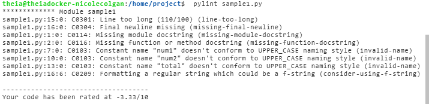
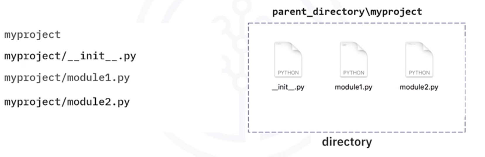

# Python coding practises and packaging concepts

## Python with Flask for Large-Scale Projects
* Python with Flask is a lightweight and flexible web application framework. It's known for its simplicity, minimalism, and ease of use. It is designed as a micro-framework providing a lightweight structure which facilitates developers in building a web application quickly and easily but not compromising on the efficiency and ability to scale up from small-scale projects to larger, more complex applications
* Flask is a good choice for smaller, simpler applications. However, 'micro' has more to do with what Flask is, rather than limiting its scalability potential. Flask can be used for large-scale systems and more complex applications with attention to specific requirements and constraints, careful planning, good architecture, and modular design, but it may require more effort to manage and scale compared to more robust and feature-rich frameworks.

Its rich and robust ecosystem provides developers with tools, libraries, and functionalities to handle web development tasks such as routing, request handling, template rendering or similar tasks. Caching, load-balancing, replication and storing your data in a scalable manner can help achieve optimal results.

When building a large-scale application using Flask or when growing your codebase or scaling your application, following techniques can be considered:

### Key flask capeabilities
* Extensibility and integration: Flask is extensible and developers can add or remove features enabling customization. Flask seamlessly integrates with other Python Key Idea,Simple Explanation,Analogy
* Extensibility & Integration: You can easily add new features (like login tools) and make Flask work well with other Python tools.,It's like a basic phone that lets you install any app you want.
* Transparent Documentation: The instructions are clear and open. You can look inside to see exactly how things work and change them if needed.,It's like a car with a clear hood—you can see the engine and fine-tune it.
* Custom Implementation: You aren't stuck with Flask's default settings. You can create your own special objects to handle incoming requests and outgoing responses.,"You can customize the foundation of your building, not just the paint color."
* Scaling Considerations: You can easily handle more users by adding more servers. The only limit is if you use a very unusual server setup that Flask's worker system can't track.,"If you double your number of chefs, you can make twice as much food."
* Modular Development: "You should build your large project in small, reusable chunks (called extensions). This makes it easier to manage and fix.","Instead of one huge essay, you write short, useful chapters you can reuse later."

### Real world applications
Today, Python with Flask has become a popular choice among big names for its simplicity, flexibility, versatility and ease of learning and use. Its minimalistic design and customizable nature make it adaptable, effective, and reliable for large-scale web development requirements in diverse industries and sectors.

Several prominent companies including Netflix, Reddit, Lyft, LinkedIn, Pinterest and Uber leverage Python with Flask in their technology stacks for specific backend services or functionalities. Python Flask benefits big companies for diverse purposes such as API development, backend services, rapid development, and prototyping, while its extensibility facilitates the addition of functionalities within their infrastructure. This suggests that it can be part of scalable architectures when combined with appropriate strategies and tools.

## Application development lifecycle
* Types of tests:
    * unit
    * performance: speed, scalability, stability
    * integration testing: everything works together and application functions within larger framework
    * user testing -> verify from user POV

## Intro to web applicarions and APIs
* A web app is a program stored on a remote server and delivered over the internet
* Web app has three main components:
    * Web Server: a special piece of software that waits for requests from users (like you typing a website address) and then handles the simplest jobs. In short, a Web Server is a fast, efficient traffic controller that handles simple tasks directly and directs all the complicated tasks to the correct application (like your Flask app).
        * When you type a website address, your request arrives at the web server first. 
        * The web server is listning on a port and manages the flow of all incoming requests
        * It looks at the request and decides where it needs to go
    * app server: It does the complex work: processing user logins, calculating results, talking to the database, and preparing the specific information needed for the user's request. its the actual backend code itself.
    * database to store data
* API architectures:
    * REST:
    * SOAP (Simple Object Access Protocol)
* Advantages of APIs:
    * Connectivity
    * Supports crud operations so you can manage data easily
    * Works with PUT, POST, DELETE, GET which are common standards to perform CRUD over the internet
    * works with HTTP making it customisable: uses HTTP which is the same language that your web browser uses to send and receive into. Because HTTP is standard and felxible, dev can cusomise how the data is sent and what actions are performed
* APIs V web-apps: 
    * API (Application Programming Interface)	The collection of all endpoints (addresses like /login or /data) and the rules for using them. It's the bridge that lets software talk to other software.
    * Web App (Web Application)	The entire product a user sees and interacts with on a website. It includes the visible parts (frontend code) and the secret logic parts (backend code).

## python dev
```python
python3.11 -m pip install numpy # run pip installer (m tool - pip)
```

## Python style guide and programming practices
* Python Enchancement proposal 8 (PEP8) which is guidlines for python dev
* use lowercasefunction and file names with underscores
* Exception: for python packages we generally dont use underscores
* use CamelCase for class names
* for constants capitalise all words and seperate with underscores eg `MAX_FILE_UPLOAD_SIZE`
* PyLint can be used for static code analysis for compliance with PEP8 guidlines. PyLint basically evaluates the code against compliance with the PEP8 coding style guide and generates comments wherever it finds an issue.

## static code analysis lab
```bash
pip3 install pylint==2.11.1 # install

# run against a file
pylint sample1.py
```

it also shows how this run compares to the last


## Unit testing
* output will be the number of tests that ran and the result - OK means te=hey all ran ok, if they fail it will output the errors

### class to test - mymodule.py
```python
# mymodule.py

def square(number):
    return number**2
```

## test class - test_mymodule - this is the naming convention -> test_{module-name}
```python
# test_mymodule.py

import unittest # has functionality needed for unit tests

from mymodule import square # import the method you want to test

# class has to inherit from TestCase
# class has `Test{camel case module name}` naming convention
class TestMyModule(unittest.TestCase):

    # if the method doesnt start with `test_` it wont run
    def test_square(self):
        self.assertEquals(square(2), 4) # assertEquals(actual, expected)

if __name__ == '__main__':
    unittest.main()
```

## python packages
* a module is a python file with functions, statements, classes. you can import a module to other scripts and notboots
```python
# mymodule.py

def square(number):
    return number**2
```
* a package is a collection of python files in a directory with an `__init__.py` file
* The contents of the init file are from the modules
* When you import a package the import is of type module


* a library is a collection of packages or a single package eg Pandas, Numpy
* packages and libraries are often used interchangeably

### creating a package:
1. Create a directory and place all the following files inside eg package1/
```python
# package1/module1.py

def square(number):
    return number**2
```
```python
# package1/module2.oy
def add(n1,n2):
    return n1+n2
```
```python
# package1/__init__.py
from . import module1   # not `.` - same dir
from . import module2
```
### verifying a package
After creating a package you need to verify it.
* open terminal
* open python interpretter by running 
```bash
python
```
* import the package by running
```bash
import {package name - folder name like package1}
```
* if the command runs without errors it indicates the package is successfully loaded
* general form for testing a package
` {package name}.{module name}.{function name}(params)`
to exit the python interpretter `exit()`
```bash
package1.module2.add(2,2)   # 4
```
* you can use the package if its in the same directory like

parent_dir/package1

parent_dir/test.py
```python
#test.py
from package1.module1 import square
from package1.module2 import add

print(square(2))
print(add(2,2))
```

### packages project
[packages-project](./projects/packages)