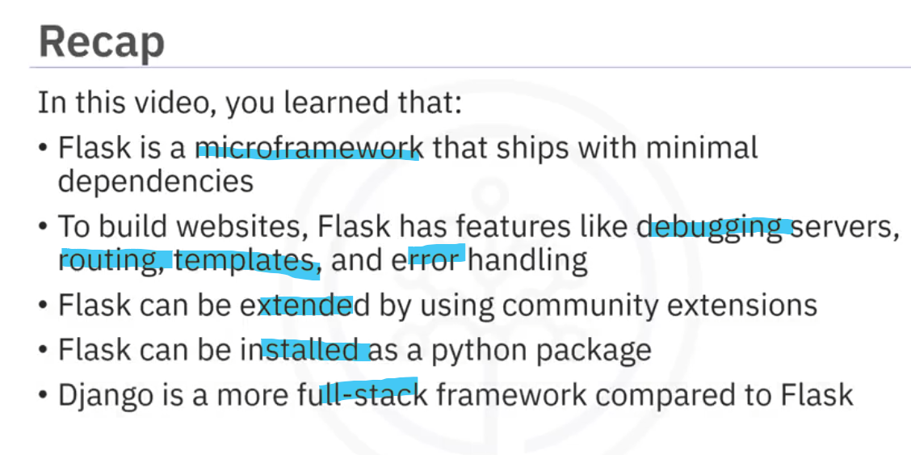
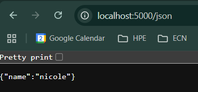
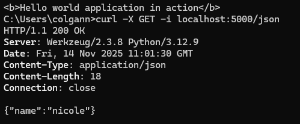
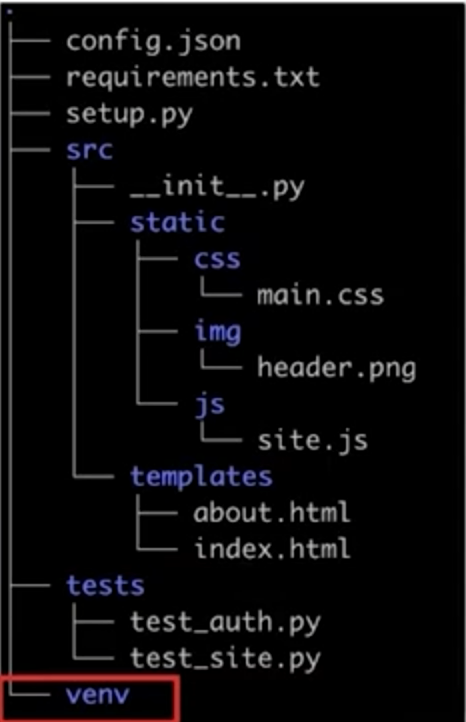
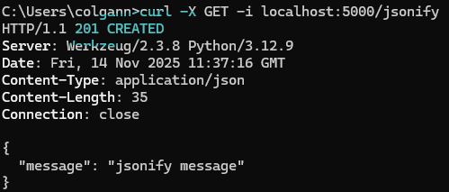
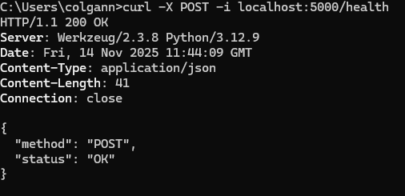
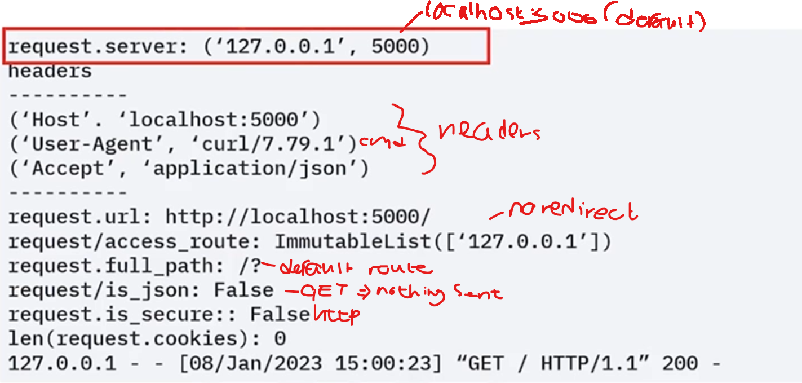
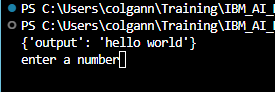

# Web app deployment with flask

## python libraries and frameworks for aplication dev

### Libraries
* numpy: working with numbers and large lists
* pandas: working with tables. cleaning, analysing and organising data easily.
* Matplotlib: data visualisation
* BeautifulSoup: web scraping
* Requests: send http requests
* SQLAlchemy: SQL toolkit
* PyTest: testing framework

### Frameworks
* Django
* Flask
* Web2Py

## Flask
* Flask is a micro-framework for creating web apps
* Flask requires python3

### Main features
* Build in web-server
* has a debugger
* Uses standard python logging
* has build in unit testing
* enables request and response classes

### Additional features
* supports static assets like css, js files
* provides dynamic template with jinja
* supoports routing and dynamic urls
* enables error handling
* supports sessions

### popular extensions
* Flask-SQLAlchemy
* Flask-Mail
* Flask-Admin: easily add admin views
* Flask-Uploads: add customised file uploads to your app

### other extensions
* Flask-CORS: enables CORS
* Flask-Migrate: adds db migrations to Flask-SQLAlchemy
* Flask-User: adds user authentication, authorisation and other user management activities
* Marshmallow: serialisation and deserialisation support
* Celery: runinng heavy/time-consuming jobs in the background

### Installation
```bash
# in venv
pip install flask==2.2.2    # install version 2.2.2
```

### Flask build in dependencies
* Werkzeug: implements server
* jinja: template language tha renders the pages in your application
* MarkupSafe: comes with jinja to give security by preventing injection into templates
* ItsDangerous is used to sign data to make sure data has not been tampered with
* Click: framework for writing command line applications

to see installed dependencies
```bash
pip freeze
```

### Flask vs. Django
* Flask is lightweight framework but Django is a full-stack framework
* Flask has basic dependencies and is extensible but Django has everything you need to create a fill-stack app
* Flask is flexible and lets developer make most of the decisiona but Django is opinionated and makes most of the decisions



## Flask - Basic application and routes

### creating main flask application
1. Install flask
2. create main server file (app.py) - [app.py](./projects/flask/app.py)
3. Use `@app` decorator to define a route. 
    * decorator takes the path as the argument (passs in URL path)
    * you can return text or html from the method
    ```python
    from flask import Flask

    app = Flask(__name__)   # instantiate object on Flask class as your app - name is name of file your currently in

    @app.route('/')
    def hello_world():
        return "<b>Hello world application in action</b>"
    ```
4. run app:
    * create system env variables/ export settings:
        * FLASK_APP: name of main server file
        * FLASK_ENV: pro, dev env etc.
        ```bash
        export FLASK_APP=app.py
        export FLASK_ENV=development
        ```
    * run:
    ```bash
    flask run
    ```
runs on port 5000 by default

## running flask with args
Instead of sestting env vars you can pass them as args to flask executable:
    * `--app`: identifies python file to run then pass the file name with no extension. In our case if were running from the flask directory, you dont need to pass in that arg if you already have a file in there called app.py that you want to use for your server cause it will check that by default
    * `--debug`: starts in debug mode - automatically restarts on file change
    > i was getting a compatibility error with workzeug. fixed it by telling flask to use werkzeug version >=2.2.2 but less than 3 `pip install "Werkzeug>=2.2.2,<3.0"`
```bash
flask --app app --debug run
```

### returning json
* return serialisable type like dict or list
```python
@app.route('/json')
def return_json():
    return {"name": "nicole"}
```


you can make a get request to this endpoint to test it. The X specifies the GET command and the -i displays header from the response
```bash
curl -X GET -i localhost:5000/json
```


* other way is to use `jsonify()` flask method and pass in kv pairs
```python
from flask import Flask, jsonify

app = Flask(__name__)   # instantiate object on Flask class as your app - name is name of file your currently in

@app.route('/jsonify')
def return_jsonify():
    return jsonify(message= "jsonify message")
```

### other application configurations
* ENV = pro, dev etc
* DEBUG = enable debug mode
* TESTING = testing mode
* SECRET_KEY = used to sign the session cookie
* SESSION_COOKIE_NAME
* SERVER_NAME = binds host and port
* JSONIFY_MIMETYPE = defaults to json

#### other ways to set consiguration
* using the config object
```python
app.config['SECRET_KEY'] = "random secret key"
```

* load current env variables into config object
```python
app.config["VARIABLE_NAME"]
app.config.from_prefixed_env()
```

* from config file
```python
app.config.from_file("path-to-config-file")
```

### application structure
* main application python module (src)
* config file
* static file folder
* template folder
* testing folder
* venv


## Flask lab
[flask](./projects/flask/)


## Request and Response objects - Using GET and POST modes

### custom routes
* `@app.route("/route-name")` defaults to GET method
* you can pass in an arugment to specify what http methods the path responds to - and return a code with it
```python
@app.route("/health")   # implicit get
def health():
    return jsonify(dict(status="OK")), 200

@app.route('/jsonify/dict', methods=["GET"])
def return_jsonify_dict():
    return jsonify(dict(message= "jsonify message")), 201

# get and post request
@app.route("/health", methods = ["GET", "POST"])
def health():
    if request.method == "GET":
        return jsonify(status="OK", method="GET"), 200
    if request.method == "POST":
        return jsonify(status="OK", method="POST"), 200

```

```bash
curl -X POST -i localhost:5000/health
```


### Request object
* all http calls to flask contain request object created from Flask.Request
* request attributes:
    * server: adress of server
    * headers: sent with request
    * URL: of resource asked by request
    * acess_route: history
    * full_path: of request including query string
    * is_secure/ https/wss
    * is_json: if request contains json data
    * cookies: dict of cookies sent with request
* header data:
    * Cache-Control: info on how to cache in browsers
    * Accept: type of content accepted by client
    * Accept-Encoding: code content
    * User-Agent: client/os/version
    * Accept-Language: requests for specific language and locale
    * Host: host and port number of requested server
Looking at an example when the client is the curl request in your terminal


## getting data from request object
* `get_data` gets POST data from request as bytes
* `get_JSON` parses POST data from request as JSON
* `args` gives you query params as a dictionary
* `JSON` will parse the data into a dictionary
* `files` provides user uploaded files
* `form` contains all values posted in a form submission
* `values` combines args data with form data

## Request object: accessing values
```python

URL = "http://localhost:5000?course=coursename&rating=10"

# extract course name and rating
# since the data is returned as a dict we can extract it as normal
from flask import Flask, request
app = Flask(__name__)

@app.route("/")
def hello_world():
    course = request.args["course"] # using indexing which returns error if arg not present
    rating = request.args.get("rating") # using get method which returns none if arg is not present
    return {"message": f"{course} with rating {rating}"}
```

## Response object

### common response attributes
* status_code
* headers
* content_type: of requested resource
* content_length
* content_encoding
* mimetype: sets media type of response
* expires

### common methods on response objects
* set_cookie: sets browser cookie on the client
* delete_cookie

# response object usage
* html 200 response automatically created from get method
* JSONify method creates json object
* can use `make_response` to make custom response
* redirect: returns 302 status code and redirect client to another url
* abort: reurn response with error condition

## dynamic routes

### calling an external API
```python
from flask import Flask, escape
import requests

app = Flask(__name__)

@app.route("/")
def get_author():
    response = requests.get("http://website.com/search/authors.JSON?q='nicole'")
    if response.status_code == 200 and query:
        return {"message": res.JSON()}
    elif res.status_code ==  404:
        return {"Message": "Something went wrong"}, 404
    else:
        return { "message": "server error"}, 500
```

### dynamic routing
* Below shows how to make dynamic routes i.e. when you want to user to enter some route and its not pre-defined
* you can also specify the type of the param `@app.route("terminals/<string:airport_code>")` or `@app.route("terminals/<int:airport_code>")`. In these cases, the route will only be triggered if the param is the correct type
* other param type examples:
    * string
    * int
    * float
    * uuid
```python
from flask import Flask, escape
import requests

app = Flask(__name__)

@app.route("/book/<string:isbn>")  #notice dynamic route and enforced param type
def get_authors(isbn):  # notice the param
    response = requests.get("http://website.com/search/{escape(isbn)}.JSON)")

    if response.statucs_code == 200:
        return {"message": response.JSON()}
    elif response.status_code == 404:
        return {"Message": "Something went wrong"}, 404

@app.route("/network/<uuid:uuid>")  # uuid param type
def uuid(uuid):
    res = requests.get("https://anotherapi/getnetwork/{uuid}.JSON")
    if res.status_code == 200:
        return {"message": res.JSON()}
    elif response.status_code == 404:
        return {"Message": "Something went wrong"}, 404
```

## Error handling

### HTTP return status
* 1xx: informational
* 2xx: success
* 3xx: redirect
* 4xx: error in request
* 5xx: server error
* flask automatically returns 200 when string or dict is returned or when jsonify method is used

# Explicitely returning status
* you can return tuple with response code or use the make_response() method
```python
@app.route("/tuple")
def tuple_res():
    return ("<p>sucess</p>", 200)

@app.route("/make_response")
def make_response_endpoint():
    res = make_response("<p>make response message</p>")
    res.status_code = 200
    return res
```

### populuar codes
* 200: success
* 201: resource created
* 202: request accepted, in progress
* 204: request complete, no response**********************
* 400: invalid request
* 401: credentials are missing or invalid
* 403: credentials not sufficient to complete request
* 404: server cant find resource
* 405: requested operation not supported
* 422 invlaid input params
* 500: server error
> note: even when you return a message with a 204 code, nothing is returned


## Building an API with flask - Route Creation, Error Handling, and HTTP Requests
[flask-api](./projects/building-an-api-with-flask/)

## Deploying web apps using flask
* supoprts crud - POST, GET, PUT/PATCH, DELETE
* creating a flask app
```python
from flask import Flask

my_app = Flask("My first app")

@my_app.route("/")
def hello_world():
    return "Hello world"

if name == "main":
    my_app.run(debug=True)
```

### rendering templates with flask
* templates serve static/dynamic html pages
* default directory for static templates is static but you can put it in another folder name as long as you explicitely set it
* flask looksd for templates in the templates dir in the root
```python
from flask import Flask, render_template, request

my_app = Flask("My first application")

@my_app.route("/sample/")
def get_sample_html():
    return render_template("sample.html")   # serve static template

@my_app.route("/user/<username>", methods=["GET"])
def greet_user(username):   # based on route
    return render_template("result.html", username=username)    # dynamic template

@my_app.route("/user", methods=["GET"])
def greet_user_based_on_req():  # based on params
    user_name = request.args.get("username")
    return render_template("result.html", username=username)

if name == "main":
    my_app.run(debug=True)
```

## decorators in flask
Decorators help in annotating the methods and tell what a particular method is meant for. These are different from comments. This is used by the interpreter while running the code.

### Method decorators
* Let’s say we have a python code where we want all the output to be in JSON format. It doesn’t make sense to include code for these in each of the methods as it makes the lines of code redundant. In such cases, we can handle this with a decorator.
* The method decorator is also referred to as the wrapper, which wraps the output of the function
* We have added this decorator to hello() and add(). The output of these method calls will now be wrapped and decorated with the jsonify_decorator.
```python

def jsonify_decorator(function):    # tajes in the function output
    def modifyOutput():
        return {"output": function()}
    return modifyOutput

@jsonify_decorator
def hello():
    return "hello world"

@jsonify_decorator  # this takes in the function output returned from the method below it
def add():
    num1 = input("enter a number")
    num2 = input("Enter another number")
    return int(num1) + int(num2)

print(hello())
print(add())
```


### route decorator
We can handle multiple routes with a single function by just stacking additional route decorators above the method which should be invoked when the route is called.
```python
@app.route("/")
@app.route("/home")
@app.route("/index")
def home():
    return "Hello World!"
```

## deploying flask project
[deploying-flask](./projects/deploying-flask-project/)

## Additional features in flask

### accesing form data with flask.request.form
You can use flask.request.form to access form data that a user has submitted via a POST request. For instance, this feature can be used if you have a login form with username and password fields.
In your HTML file, you might have a form like this:
```html
<form method="POST" action="/login">
    <input type="text" name="username">
    <input type="password" name="password">
    <input type="submit" value="Submit">
</form>
```
The Python code to access the username and password will be as follows:
```python
from flask import request
@app.route("/login", methods=["POST"])  # form with this action and this http method calls this endpoint
def login():    
    username = request.form["username"]
    pw = request.form["password"]
    # process login ...
```

### Redirecting to a URL with flask.redirect
Flask provides a function called flask.redirect to guide users to a different webpages (or endpoints). The flask.redirect function can be useful in several scenarios. For example, you can use the flask.redirect function to redirect a user to a login page when they try to access a restricted admin page.
```python
from flask import redirect

@app.route("/admin")
def admin():
    return redirect("/login")
```

### Generating Dynamic URLs with flask.url_for
The simplest way to think about url_for is that it's a smart lookup tool for web addresses (URLs).

Instead of you typing out the actual path (like "/login"), you tell Flask the name of the function you want, and url_for finds the correct web address for you.

```python
from flask import url_for

@app.route("/admin")
def admin():
    return redirect(url_for("login"))

@app.route("/login")
def login():
    return "<login page>
```

### Handling different http requests
Flask allows you to define routes to manage different types of HTTP requests. You can define the route with both the access methods, GET and POST, and in the function description, define the use cases for both methods.

Python code:
```python
@app.route('/data', methods=['GET', 'POST'])
def data():
    if request.method == 'POST':
        # process POST request
    if request.method == 'GET':
        # process GET request
```

In the HTML file, you will add a form that allows both GET and POST requests:
```html
<!-- For POST -->
<form method="POST" action="/data">
    <!-- Your input fields here -->
    <input type="submit" value="Submit">
</form>

<!-- For GET -->
<a href="/data">Fetch data</a>
```

### CRUD operations

#### create
html form for creating data
```html
<form method="POST" action="/create">
    <input type="text" name="name">
    <input type="submit" value="Create">
</form>
```
python code:
```python
@app.route("/create", methods=["GET", "POST"])
def create():
    if request.method == "POST":
        name = request.form["name"] # access form data
        record = create_new_record(name)    # assuming you have this function created
        return redirect(url_for("read", id=record.id))  # redirect to dynamic read page to see new record
    return render_template("create.html")   # GET method to give create html
```

### Read operation
Reading data involves accessing the data and presenting it to the user. To access specific entries, the request needs to go with specific IDs. Therefore, you will need to pass the ID as an argument to the function. The following example shows that the ID can be accessed from the route.
```python
@app.route("/read/<int:id>", methods=["GET"])
def read(id):
    #get record by id
    record = get_record(id) # assuming this function is defined
    return render_template("read.html", record=record)
```

### Update operation
Updating data requires the process of accessing specific entries, like the Read operation, and involves giving new data to the concerned parameter, like the Create operation. Therefore, the route should access the ID and contain both access methods.

sample html
```html
<form method="POST" action="/update/{{record.id}}">
    <input type="text" name="name" value="{{record.name}}">
    <input type="submit" value="Update">
</form>
```
python code:
```python
@app.route('/update/<int:id>', methods=['GET', 'POST'])
def update(id):
    if request.method == 'POST':
        # Access form data
        name = request.form['name']
        # Update the record with the new name
        update_record(id, name)  # Assuming you have this function defined
        # Redirect user to the updated record
        return redirect(url_for('read', id=id))
    
    # Render the form for GET request with current data
    record = get_record(id)  # Assuming you have this function defined
    return render_template('update.html', record=record)
```

### Delete operation
Deleting data involves removing a record based on its ID. The Delete operation will typically require the ID to be passed, as reported by the HTML page, in the form of an argument to the function.

Sample HTML form for deleting data:
```html
<form method="POST" action="/delete/{{record.id}}">
    <input type="submit" value="Delete">
</form>
```

Python code:
```python
@app.route('/delete/<int:id>', methods=['POST'])
def delete(id):
    # Delete the record
    delete_record(id)  # Assuming you have this function defined
    # Redirect user to the homepage
    return redirect(url_for('home'))
```
